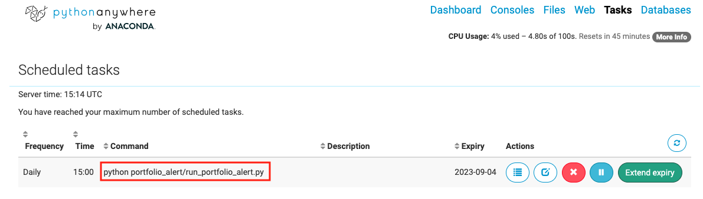
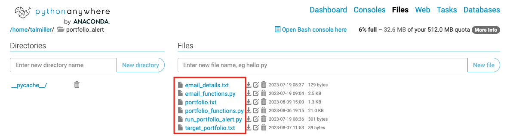

# portfolio_alert

Rebalancing a portfolio based on target weights can be done with some frequency (e.g. monthly or quartely), or actively based on a deviation of the portfolio weights from the target weights. This code is designed for the latter, but can trivially be also used for the former.  

The run_portfolio_alert.py script monitors your portfolio (instantly or daily as a cron job), and alerts by email if rebalancing is required, while also giving the exact rebalancing instructions.
This directory needs to contain the files:
- **email_details.txt**: Details to the email (if none then will print to screen). Note that the password is not the standard gmail password but a dedicated "apps password", to set it up read the
    tutorial https://support.google.com/accounts/answer/185833?hl=en
- **portfolio.txt**: Write the status of the portfolio positions for the current date (in number of shares). The code will translate this to the actual value of the positions to use internally, but also update the file daily with the position weights. Only the last line of the file is used internally.
- **target_portfolio.txt**: Define the target weights of the portfolio and the tolerance % for rebalancing.

Notes:

- Currently only supports positions denoted tranded in USD currency and that can be accessed with the yfinance python package (stock names as they appear in Yahoo Finance).
- Cash is also a valid position.
- Positions can have two types "rebalanced" or "minimal_weight". 
- The minimal_weight positions must sum to less than 100%, and the rebalanced positions need to add up to exactly 100% (relative to what is left apart from the minimal_weight portion of the portfolio).
- The tolerance is given in percents. Meaning, if any position weight exceeds its target weight by that amount of percents, a rebalancing alert is triggered.
- Example input files are in the example_files directory.

## How to use

The script "run_portfolio_alert.py" can also run offline without sending the alert by email if you want updated rebalancing instructions for example. But the real use is for it to run as a daily job and alert only if a rebalancing is required.

In www.pythonanywhere.com, open a folder under the Files tab:

Dump the files in the folder:

Set up the cron job under the Tasks tab as follows with the command "python portfolio_alert/run_portfolio_alert.py":

Note that in the free version the cron job has a one month expiry date that would need to be renewd using the "Extend expiry" button. This kind of defies the purpose of this tool but is the best I came up with currently that is free.

